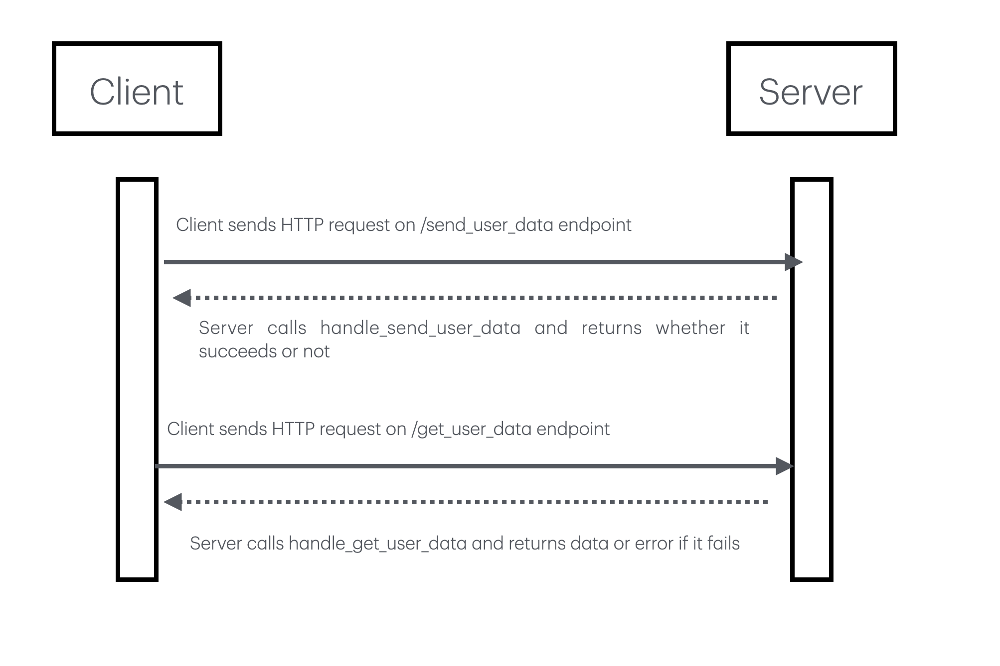

# json-database-service
CS361 Small pool microservice for saving and retrieving JSON data.

## Request data

Send an HTTP POST request to the endpoint /get_user_data with your key.

```py
get_response = requests.post(
    "http://127.0.0.1:5000/get_user_data",
    json={
        "key": "test_user"
    }
)
```

## Send data

Send an HTTP POST request to the endpoint /send_user_data with your key and data.

```py
send_response = requests.post(
    "http://127.0.0.1:5000/send_user_data",
    json={
        "key": "test_user",
        "data": {
            "email": "test@example.com",
            "role": "student"
        }
    }
)
```

## UML diagram



## Implemented Features
- Save JSON data
- Retrieve JSON data
- Reject invalid JSON requests

## Communication Pipe
REST API

## Developers
- Najhae Justice
- Fox Caminiti
- Ilium East
